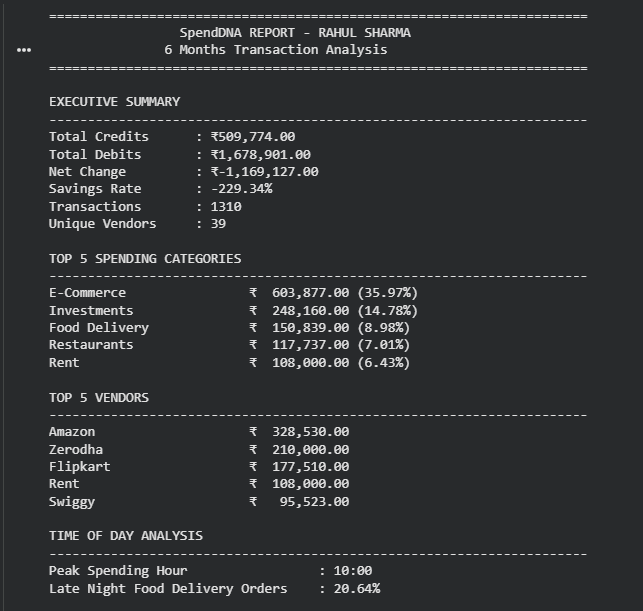
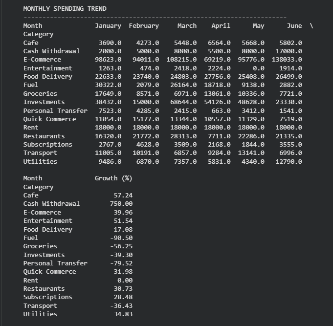
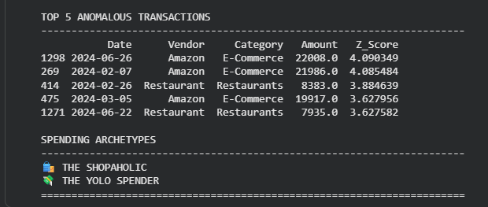

# 💳 SpendDNA – Transaction Analytics

A Python-based transaction analytics project that analyzes bank transactions to generate spending insights, detect anomalies, and identify financial spending archetypes.

---

## 📌 Project Overview

SpendDNA analyzes six months of banking and UPI transaction data of a fictional software engineer, Rahul Sharma. The project cleans raw transaction data, extracts vendor names, categorizes expenses, identifies spending patterns, detects anomalies using statistical analysis, and generates a comprehensive financial report.

---

## 🚀 Features

- Transaction Parsing & Data Cleaning
- Vendor Extraction
- Spending Category Mapping
- Spending Overview
- Monthly Trend Analysis
- Time-of-Day Spending Analysis
- Z-Score Based Anomaly Detection
- Spending Archetype Detection
- Final SpendDNA Report

---

## 🛠️ Tech Stack

- Python
- Pandas
- NumPy
- Google Colab

---

## 📂 Dataset

- 6 Months of Transactions
- 1300+ Banking Records
- Multiple Date Formats
- Multiple Transaction Types
- Realistic Indian Banking & UPI Transactions

---

## 📊 Analysis Performed

- Data Cleaning
- Vendor Normalization
- Category Tagging
- Spending Analysis
- Monthly Spending Trends
- Time-Based Spending Analysis
- Statistical Anomaly Detection
- Financial Personality Detection

---

## 📁 Repository Structure

```text
SpendDNA-Transaction-Analytics/
│
├── SpendDNA_Aliasgar_Vandeliwala.ipynb
├── Data set for DADS June.csv
├── README.md
└── images/
    └── spenddna_report.png
```

---

## ▶️ How to Run

1. Clone this repository.

```bash
git clone https://github.com/Aliasgar24/SpendDNA-Transaction-Analytics.git
```

2. Open the notebook in Google Colab or Jupyter Notebook.

3. Place the dataset in the same directory.

4. Run all notebook cells.

---

## 🎯 Learning Outcomes

This project demonstrates practical knowledge of:

- Data Cleaning
- Exploratory Data Analysis (EDA)
- Transaction Analytics
- Business Intelligence
- Statistical Analysis
- Python Programming
- Pandas & NumPy

---

## 👨‍💻 Author

**Aliasgar Vandeliwala**

B.Tech – Computer Science and Design

Passionate about Data Analytics, Python and UI/UX Design.

---

⭐ If you found this project useful, consider giving it a star.


---

# 📸 Project Output

The following screenshots show the final SpendDNA report generated by the project.

## Part 1 – Executive Summary



---

## Part 2 – Spending Analysis



---

## Part 3 – Archetypes & Insights


